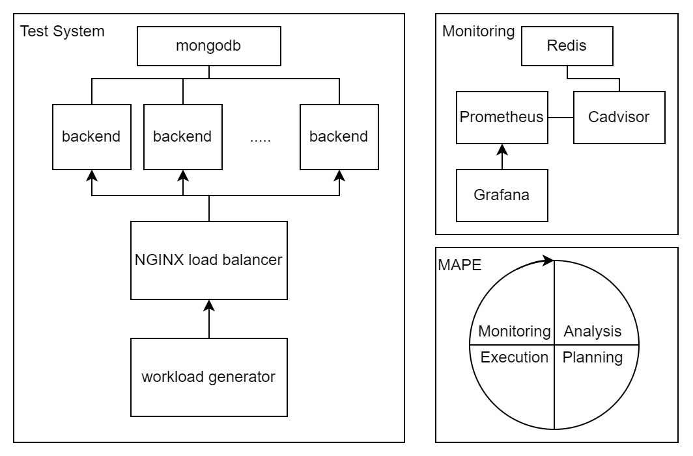

# Multi-Objective Economic Adaptation for Service Ecosystems on the Cloud : A Container-Based Implementation

#### An implementation of the paper [Multi-Objective Economic Adaptation for Service Ecosystems on the Cloud](./res/TSC2017.pdf) [^our] by *Marios Fokaefs*, *Cornel Barna* and *Marin Litoiu*.




## What is the MAPE framework?

The MAPE framework, initially proposed by IBM in the paper "An architectural blueprint for autonomic computing" [^mape], has four components named **Monitoring**, 
**Analysis**,
**Planning**, and 
**Execution** .This framework is used to monitor and enhance software systems periodically. Each of the four components can be implemented differently depending on the purpose of the system. However, in the monitoring stage, we usually fetch measurements and insights from the system. In the analysis stage, we use that data to give the owner some warnings or analyze which parts of the system are not working as expected. In the planning stage, we make some decisions based on the outputs of the previous stage. These decisions are changes in some aspects of the system to get it back to the working state with expected performance. Finally, in the execution stage, we apply those decisions to the system. These stages form the MAPE cycle, which runs periodically (for example, every hour or every minute) to keep the system running and high-performing through environmental changes.

## Using MAPE To Achieve Economic Goals

The implemented paper uses the MAPE framework to reach an economic purpose. Supposing that we have these stakeholders:
- a cloud provider that provides infrastructure for backend services.
- a service provider that owns the backend services.
- an application provider that owns the front-end software.
- end users of the application.
- 
We are trying to maximize each stakeholder's profit * while preserving the system's performance during sudden load changes.
<small>* The end user's profit defines as the user's satisfaction. </small>


## How Our implementations works

How Our implementations works
In our case, the example backend software is a simple Flask web application. It validates and processes generated IoT data from the workload generator and stores them in a MongoDB database.
Each replica of this backend runs in a docker container.
We can take two approaches to implementing different components of the MAPE framework. 
The first approach, which is implemented [here](https://github.com/Vlaquit/EASE-MAPE-System), uses [Docker stats](https://docs.docker.com/engine/reference/commandline/stats/) to monitor CPU, network, and memory usage of docker containers running the application. In this approach, the analysis stage is called threshold analysis. It determines if each resource's usage has reached a certain threshold. The Planning stage decides to add or remove one replica 
based on the data from the previous stage. Finally, the execution phase applies this decision.

The implemented paper takes an economical approach to the problem. Supposing that we have these stakeholders: 
- a cloud provider that provides infrastructure for backend services.
- a service provider that owns the backend services.
- an application provider that owns the front-end software.
- end users of the application.

We are trying to maximize the profit for all stakeholders while preserving the system's performance during sudden traffic changes. (end user's profit defines their satisfaction.)

The workload generator software sends different loads of requests to the backend service. The number of concurrent sensors working determines the load. The workload generator also sends some metrics to Prometheus. These metrics contain the number of concurrent users, total requests sent, average response time, average data payload, and arrival rate of the requests.

In the monitoring stage, we fetch the metrics plus some system metrics from the cadvisor from Prometheus. In the


in our case the software is a simple Flask web application that calculates pi up to given number of digits and it is running as one or more [docker](https://www.docker.com/) containers . we can have 2 approaches to implement different components of the MAPE framework. the first approach which is implemented [here](https://github.com/Vlaquit/EASE-MAPE-System) (and we have forked that as the baseline) uses [Docker stats](https://docs.docker.com/engine/reference/commandline/stats/) to monitor CPU,network and memory usage of docker containers running the application .in the threshold analysis it decides to add or remove one container if usage of each resource had reach a certain threshold. planning and execution phase completed and applied the decision.

We have implemented an economic approach to the problem. supposing that we have cloud provider, one service provider, one application provider and users as the stakeholders of the system (for users profit defines as satisfaction from the service), we are try to maximize the profit for all of them meanwhile preserving the system's performance in times of sudden traffic change.

so we consider this flask application as a simple web service and in the monitoring phase we send different loads of request from different number of users concurrently (simulating sudden changes in service traffic) using [Apache Bench](https://en.wikipedia.org/wiki/ApacheBench) and then read *average response time*,*average data payload* and *arrival rate* of the requests in the analysis phase. in the planning phase we feed these data with some constants to [NSGA II](https://www.sciencedirect.com/science/article/pii/S1877705811022466) (using [pymoo](https://pymoo.org/) library) which is a genetic algorithm for multi objective optimization in python. and with some formula we choose the best values for *service providers price for each request (Pi_s)*, *number of containers to use (W)* , *average number of banners to show in application (gamma)* over the pareto front that the algorithm gives us. the execution phase for this approach is not yet developed but in this case it should change the number of replicas in [Docker Swarm](https://docs.docker.com/engine/swarm/) for the web service provider.

## How to run

**Prerequisites:**

- Linux OS
- Docker
- Docker Compose
- Python 3.8
- Python-pip

firt clone project into current directory. then install python requirements using pip by running this command in project root:

```bash
pip3 install -r requirements.txt
```

then run required containers using docker-compose:

```bash
sudo docker-compose up -d
```
make `log` folder in project root

```bash
mkdir log
```
at last run python code with sudo access by running below command in project root:

```bash
sudo python3 mape/dockercompose_autoscale.py
```
after cloning the project first you run the *mongodb* database by running this command in the root of the project

```bash
sudo docker-compose -f ./db/docker-compose.yml up -d
```

then you build the docker image of the `picalculator` flask app

```bash
sudo docker build --tag picalculator ./picalculator
```

then you build the docker image of the MAPE system. (this docker builds provide project with the required dependencies like flask, apache bench, etc. )

```bash
sudo docker build -t mape_system:latest .
```

then you run the Flask app and MAPE system using docker compose

```bash
sudo docker-compose up
```

[monitoring postman collection](https://documenter.getpostman.com/view/16768507/UyrHesw8)

[^our]: :page_facing_up: [Multi-Objective Economic Adaptation for Service Ecosystems on the Cloud](./res/TSC2017.pdf)

[^mape]: :page_facing_up: [An architectural blueprint for autonomic computing](https://www.semanticscholar.org/paper/An-architectural-blueprint-for-autonomic-computing-Sinreich/47c37d43f43e2be57f6f2bc668979f784911e953)