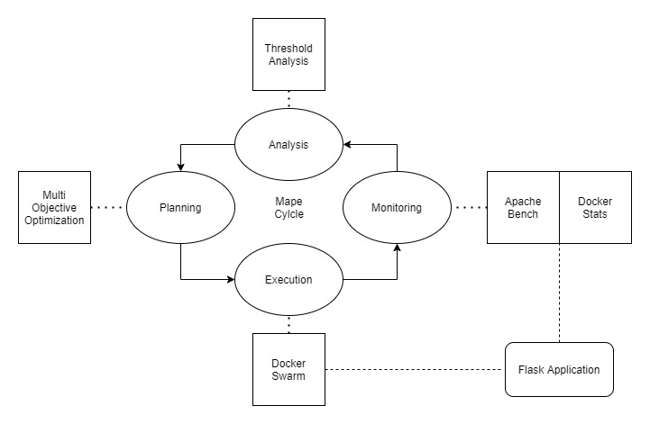

# Economic Adaption in MAPE

##### A MAPE framework implementation of Multi-Objective Economic Adaptation for Service Ecosystems on the Cloud

this is an implementation of the paper [Multi-Objective Economic Adaptation for Service
Ecosystems on the Cloud](TSC2017.pdf) by *Marios Fokaefs*, *Cornel Barna* and *Marin Litoiu*.

## What's MAPE framework

MAPE framework has 4 components of **M**onitoring, **A**nalysis, **P**lanning and **E**xecution and it is used to monitor and enhance software systems periodically. each of the four components can be implemented differently depending on the purpose of the system but usually in monitoring phase we get some measurements and insights from the system, in the analysis phase we use that data to give the owner some warnings or change some aspects of the system in order for it to work correctly. in the planning phase we make some decisions based on the pervious data for the system and in the final phase we apply those decisions to the system. and this phases run periodically (for example every hour) to keep up with the environment.

## How this implementations works



in our case the software is a simple Flask web application that calculates pi up to given number of digits and it is running as one or more [docker](https://www.docker.com/) containers . we can have 2 approaches to implement different components of the MAPE framework. the first approach which is implemented [here](https://github.com/Vlaquit/EASE-MAPE-System) (and we have forked that as the baseline) uses [Docker stats](https://docs.docker.com/engine/reference/commandline/stats/) to monitor CPU,network and memory usage of docker containers running the application .in the threshold analysis it decides to add or remove one container if usage of each resource had reach a certain threshold. planning and execution phase completed and applied the decision.

We have implemented an economic approach to the problem. supposing that we have cloud provider, one service provider, one application provider and users as the stakeholders of the system (for users profit defines as satisfaction from the service), we are try to maximize the profit for all of them meanwhile preserving the system's performance in times of sudden traffic change.

so we consider this flask application as a simple web service and in the monitoring phase we send different loads of request from different number of users concurrently (simulating sudden changes in service traffic) using [Apache Bench](https://en.wikipedia.org/wiki/ApacheBench) and then read *average response time*,*average data payload* and *arrival rate* of the requests in the analysis phase. in the planning phase we feed these data with some constants to [NSGA II](https://www.sciencedirect.com/science/article/pii/S1877705811022466) (using [pymoo](https://pymoo.org/) library) which is a genetic algorithm for multi objective optimization in python. and with some formula we choose the best values for *service providers price for each request (Pi_s)*, *number of containers to use (W)* , *average number of banners to show in application (gamma)* over the pareto front that the algorithm gives us. the execution phase for this approach is not yet developed but in this case it should change the number of replicas in [Docker Swarm](https://docs.docker.com/engine/swarm/) for the web service provider.

## How to run

**Prerequisites:**

- Linux OS
- Docker
- Docker Compose
- Python 3.8
- Python-pip

firt clone project into current directory. then install python requirements using pip by running this command in project root:

```bash
pip3 install -r requirements.txt
```

then run required containers using docker-compose:

```bash
sudo docker-compose up -d
```
make `log` folder in project root

```bash
mkdir log
```
at last run python code with sudo access by running below command in project root:

```bash
sudo python3 mape/dockercompose_autoscale.py
```
after cloning the project first you run the *mongodb* database by running this command in the root of the project

```bash
sudo docker-compose -f ./db/docker-compose.yml up -d
```

then you build the docker image of the `picalculator` flask app

```bash
sudo docker build --tag picalculator ./picalculator
```

then you build the docker image of the MAPE system. (this docker builds provide project with the required dependencies like flask, apache bench, etc. )

```bash
sudo docker build -t mape_system:latest .
```

then you run the Flask app and MAPE system using docker compose

```bash
sudo docker-compose up
```

[monitoring postman collection](https://documenter.getpostman.com/view/16768507/UyrHesw8)
